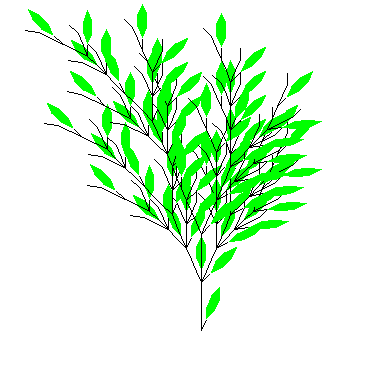
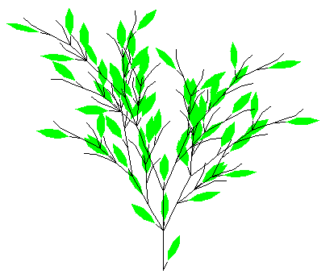
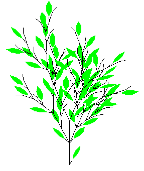
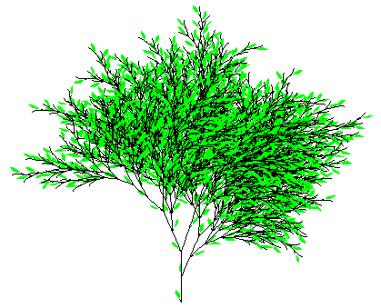
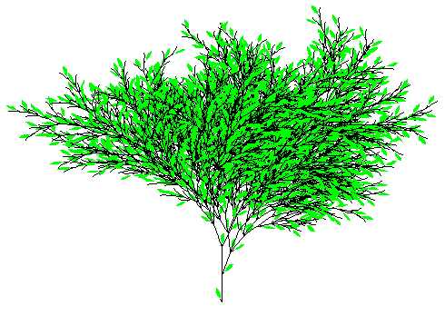
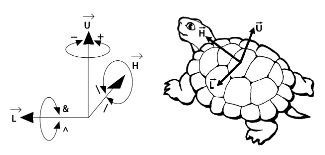
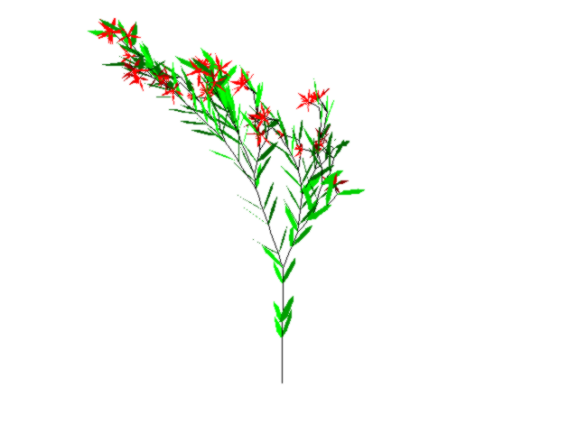
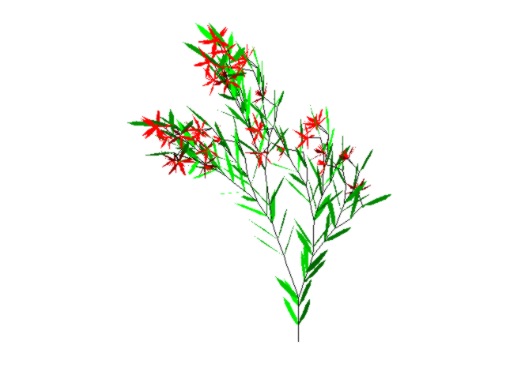
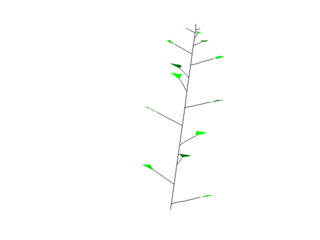
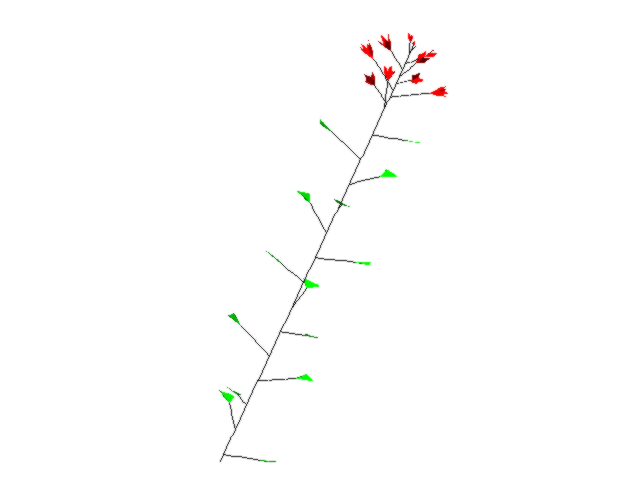

# L-system with python
2D and 3D drawing of L-system on python, using the turtle module of python for 2D drawings and "Géotortue" (http://geotortue.free.fr/index.php) for 3D drawings

The code of the project is in python/ and the book (pdf version) on which the project is based is located in doc/.

## Examples of figures obtained :

### With bracketed L-system:

### With stochastic L-system:
* Two examples at level 4 :

* And two examples of the same l-system at level 7 :

### In 3D:

We can extend the L-system to 3D by adding new symbols to control the rotation of the turtle :

With this we can now draw flowers :

And by adding parameters to the different growth functions, we can draw real plants. Here we draw the *Capsella bursa-pastoris* :
* At level 15 :

* At level 25 :

